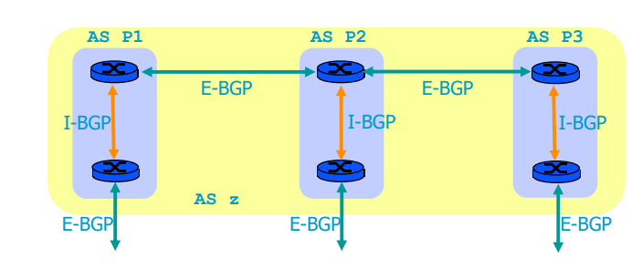

# BGP

Sources:

- https://www.youtube.com/watch?v=_Z29ZzKeZHc
- https://en.wikipedia.org/wiki/Border_Gateway_Protocol
- Computer Networking: Principles, Protocols, and Practice (https://ufdc.ufl.edu/AA00011742/00001)
- https://networklessons.com/bgp/bgp-route-reflector
- https://www.youtube.com/watch?v=3qZX1zsMLbU
- https://archive.nanog.org/meetings/nanog53/presentations/Sunday/bgp-101-NANOG53.pdf
- https://www.noction.com/blog/bgp-next-hop
- https://moodle.epfl.ch/pluginfile.php/2731792/mod_resource/content/1/bgpSols.pdf

1. BGP is path vector protocol. What is path? it's the AS path. So it is something like "to go to 69.69.69.0/24 the path is ASN 65576, 64585, 65538".
   1. Autonomous System (AS): a single network that is under a single administration with a single routing policy
2. Why BGP for internet routing?
   1. internet is large. we cannot use OSPF, for example, because every node maps the whole route.
   2. the networks in the internet are run by different organizations. So each organization can choose the way the run the network inside their own AS.
   3. need a policy based routing.
3. 2 BGP routers that are connected and work together is called BGP peered routers.
   1. If they belong to the same AS, it's called iBGP peer
   2. If they belong to different ASes, it's called eBGP peer
4. iBGP peer does not forward the advertisement that comes from an iBGP peered router to another iBGP peer. That's why iBGP routers must be connected in a fully meshed. If the number of iBGP routers are too many to be in a full mesh, we can use Route Reflector (RR) that forward the advertisement to another iBGP routers, see [networklessons.com](https://networklessons.com/bgp/bgp-route-reflector)
5. To prevent loops, BGP router does not forward/save advertisement that contains its' own AS number in the path. In other words, a route that is learned from an iBGP peer will not be advertised to another iBGP peer router. This is called **split horizon**.
   1. Also, routes learned from iBGP are not repeated to iBGP.
6. If there are 2 path to a certain subnetwork, BGP prefers the longest prefix match.
   1. For example:
      1. Path 1: AS 65534, 65535 for 1.1.1.0/24
      2. Path 2: AS 65576, 62345 for 1.1.0.0/16
   2. When there is a traffic towards 1.1.1.64, it will choose path 1. Vulnerability: BGP hijacking, see [wiki](https://en.wikipedia.org/wiki/BGP_hijacking).
7. In order to be able to route traffic from inside to outside AS, the AS border router must be configured with `next-hop-self` to the interior AS.
   1. This information is put in the BGP UPDATE message, in a form of BGP attribute: NEXT_HOP attribute. It simply means IP address that is learned from that UPDATE message will be forwarded to the IP address in the NEXT_HOP atrribute. So, if the edge router of the AS says the NEXT_HOP attribute is itself, the iBGP routers forward the IP address (that is learned from the UPDATE message from that edge router containing the edge router IP address as the NEXT_HOP) to the outside AS through that edge router.
   2. However, this attribute is not changed when crossing through iBGP networks. So if edge router is `A`, the NEXT_HOP is `A`, `A` is connected to `B`, `B` to `C`, `C` knows that the next hop is the `A` but cannot just forward to `A`. That's why we need IGP routing protocol so that C can forward to A.
8. The interior AS routing protocol can be any IGP such as OSPF, EIGRP, RIP, IS-IS, etc.

## How BGP works

Sources:

- https://www.networkers-online.com/blog/2010/03/bgp-routing-information-base-rib
- https://moodle.epfl.ch/pluginfile.php/2731792/mod_resource/content/1/bgpSols.pdf
- https://www.cisco.com/c/en/us/support/docs/ip/border-gateway-protocol-bgp/13753-25.html

1. BGP messages are sent over TCP
2. BGP messages:
   1. OPEN
   2. NOTIFICATION
   3. KEEPALIVE
   4. UPDATE: contains route modifications, additions, withdrawals of prefixes (prefix = Network Layer Reachability Information (NLRI)). Attributes are sent here.
3. A route is made of:
   1. destination
   2. AS path
   3. Attributes: BGP selects the best path based on attributes. More on this later.
      1. Well-known attribute: 
         1. NEXT_HOP, ORIGIN, AS-PATH
      2. Well-known discretionary: 
         1. LOCAL_PREF: used inside an AS to select the best AS path
      3. Optional transitive: AGGREGATOR
      4. Optional nontransitive: WEIGHT
4. BGP routers keep the BGP information (routes + attributes) in a data structure named Routing Information Base (RIB).
   1. Adj-RIBs-In: store the BGP routing information received from peers
   2. Local RIB: after applying policies and decision process, the routing information is kept here
   3. Adj-RIBs-out: stores the routing information that is advertised by this router.


Model of a BGP router. Image source: Page 19 of https://moodle.epfl.ch/pluginfile.php/2731792/mod_resource/content/1/bgpSols.pdf

See [this](mpls.md#mpls-ldp) too for the relationship between RIB and FIB.


## BGP Attributes

Source: https://networklessons.com/bgp/bgp-attributes-and-path-selection

As an analogy, IGP selects the path with the lowest metric, e.g., RIP selects the one with the lowest hop count, or OSPF selects the one with the least cost. BGP selects the path based on the attributes.

How the decision process of BGP works (the best path decision) is by seeing these in order:

1. Prefer the path with the highest WEIGHT attribute
2. Prefer the path with the highest LOCAL_PREF attribute
3. Prefer the path with the shortest AS_PATH
   1. Can be relaxed with router command `bgp bestpath as-path multipath-relax`. Usually done for load balancing.
4. Prefer the path with the lowest origin type
5. Prefer the path with the lowest multi-exit discrimiator (MED)
   1. MED is used between ASes over eBGP to tell one provider AS which entry link to prefer.
6. Prefer eBGP over iBGP paths
7. Prefer the path with the lowest IGP metric to the BGP next hop (shortest path to the NEXT_HOP, according to IGP)

### BGP Community Attribute

Sources:

- https://networklessons.com/bgp/bgp-communities-explained
- https://www.networkers-online.com/blog/2008/09/understanding-bgp-communities/

BGP community attribute is some extra value that can be assigned to specific prefix(es) and advertised to other neighbors.

What is "community" by the way? It actually refers to a group of prefixes that should be treated the same way. BGP community attribute is used to mark a set of prefixes that should be treated in a certain same way. For example, providers can use community attribute to apply a common routing policy such as assigning a certain LOCAL_PREF or WEIGHT. To put it simply, BGP community attributes can be used for traffic engineerng and dynamic routing policies.

4 well known BGP communities:

- Internet: advertise to all neighbors
- no-advertise: don't advertise to any
- no-export: don't advertise the prefix to any eBGP neighbor
- local-AS: don't advertise the prefix outside sub-AS (for BGP confederation)

## Redistribution of BGP into IGP

Only routes learnt from eBGP peers are redistributed into IGP. Some operators avoid this because the routing entries in IGP will be too large.

One of the solution is to use MPLS. See page 53 of https://moodle.epfl.ch/pluginfile.php/2731792/mod_resource/content/1/bgpSols.pdf

```
ASX          AS Y       AS Z
R1 - ( PE1 - P - PE2 ) - R2
```

PE1 and PE2 forms an iBGP peer session. P only runs IGP (like OSPF) and MPLS, no BGP.

## Other things in BGP operations

### Unstability of BGP route: BGP route flapping

Source: 

- https://ccieblog.co.uk/bgp/bgp-dampening
- https://www.cs.colostate.edu/~massey/pubs/tr/massey_usctr03-805.pdf
- https://tools.ietf.org/id/draft-jakma-mrai-00.html -> I've talked to him. How lucky I am to see a big shot like this guy.

If a route is updated, withdrawn, updated, withdrawn again, the route is said to be **flapping/route flap**. This can cause CPU congestion on routers because they need to re-compute the best path again and again too quickly. This also makes the BGP route convergence is not reached.

BGP has two ways to combat the unstable BGP route: Minimum Route Advertisement Interval (**MRAI**) and **route flap damping/dampening** (for me who is a not native speaker: dampening means make something less strong. In this case, it weakens the flapped route frequent advertisement by postponing the advertisement). Both have the same goal: reduce the propagation of unstable routes throughout a network.

MRAI works on time scale of seconds: for eBGP advertisement, the MRAI is 30 seconds. For iBGP, 5 seconds.

Route damping works on a longer time scale: minutes.

The idea of route flap damping is to postpone the calculation for the local RIB. So it's kept in the adj-RIB-in, shown in the figure:


Image source: page 69 of https://moodle.epfl.ch/pluginfile.php/2731792/mod_resource/content/1/bgpSols.pdf

The y axis shows the "penalty". Each flap that occurs will give a penalty score of 1000, applied cummulatively. If the penalty reaches the suppress-limit, the route is dampened, which means the router will stop advertising this flapped route to neighbors.

The default values:

- penalty: 1000
- suppress limit: 2000
- reuse limit: 750
- half-life: 15 minutes
- maximum suppress limit: 60 minutes

When a route is dampened, first of all wait until there is no flap. If there is no more flap, a half-life timer will count for 15 minutes (see half-life value above). After 15 minutes, the penalty is cut by half (for example, 3000, 1500, 750, etc). Once the penalty is below half of the re-use limit, the penalty is removed and route can be advertised again.

According to [RFC 4271](https://tools.ietf.org/html/rfc4271#page-96):

> To avoid excessive route flapping, a BGP speaker that needs to
> withdraw a destination and send an update about a more specific or
> less specific route should combine them into the same UPDATE message.

### Reducing iBGP peerings

Sources:

- https://networklessons.com/bgp/bgp-confederation-explained
- https://networklessons.com/bgp/bgp-route-reflector

iBGP needs to be fully meshed. A nightmare if the network is large. Confederations and route reflector can reduce the number of iBGP peerings.


Image source: https://networklessons.com/bgp/bgp-confederation-explained

a. Confederations

The idea of confederation is to have sub-ASes inside AS (confederation = consists of a number of groups united in an alliance). We use Local-AS BGP community attribute to make sure that the prefix not advertised outside sub-AS.


Image source: https://networklessons.com/bgp/bgp-confederation-explained



Image source: page 71 of https://moodle.epfl.ch/pluginfile.php/2731792/mod_resource/content/1/bgpSols.pdf

b. Route reflector


Image source: https://networklessons.com/bgp/bgp-route-reflector

Route reflector's type of peerings:

- eBGP neighbor
- iBGP client neighbor
- iBGP non-client neighbor

The Route Reflector (RR) reflects the route to the client neighbor.

Rules:

- A route learned from an eBGP neighbor can be forwarded to another eBGP neighbor, client, and non client (= all)
- A route learned from a client can be forwarded to another all
- A route learned from a non-client is forwarded to eBGP neighbor and client, but not to a non-client.

### BGP in the data center

Sources:

- https://archive.nanog.org/meetings/nanog55/presentations/Monday/Lapukhov.pdf
- https://www.oreilly.com/library/view/bgp-in-the/9781491983416/

Why BGP in the data center? Why not IGP? Why eBGP? Why not iBGP?

1. BGP has simpler data structure than IGP (for example, OSPF): BGP RIB is simpler than LSDB
2. Why not iBGP: we avoid fully meshed peers and not consistent best path selection due to the IGP metric cost
3. BGP allows per hop traffic engineering: for unequal cost anycast load balancing
4. Nontechnical reason: eBGP implementation that is implemented by hardware vendor is more robust than iBGP/IGP implementations

Private AS number is used within the data center, as it runs eBGP inside [[BGP in the data center book](https://www.oreilly.com/library/view/bgp-in-the/9781491983416/)].

It is also used for the router that is connected to the provider. For example:

```
[my company] - [some ISP]
priv ASN         pub ASN
```

Provider translate the private ASN to the ISP's ASN when exporting routes to the outside world. Not all clients need ASN, though. Basically, only transit AS needs ASN.

TODO: BGP path hunting.

# Security: BGP hijacking

TODO
