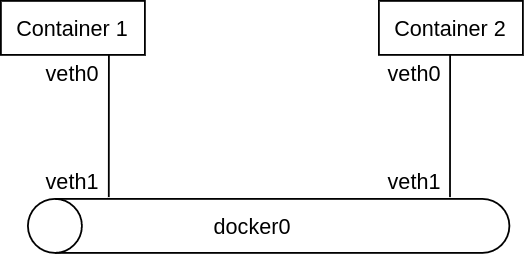
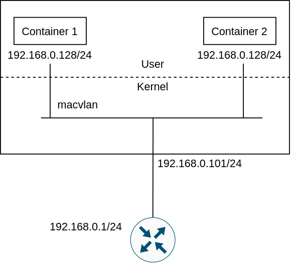
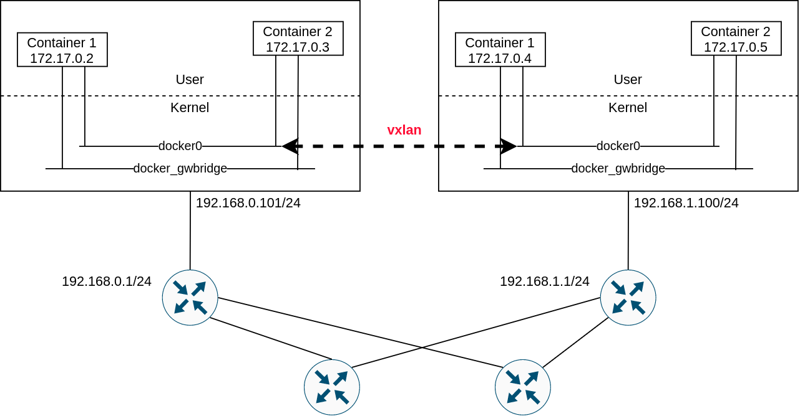

# Container Networking

Source:

- [Cloud Native Data Center Networking](https://cumulusnetworks.com/lp/cloud-native-data-center-networking/)
- https://docs.docker.com/network/

First, about containers [here](../os/docker_for_dummies.md).

## Network namespace

network namespace (netns) allows for multiple network stack, and have multiple containers on one machine to listen to the same port number.

To create a new network namespace with a name `myownnetspace`, for example, we can use:

```bash
sudo ip netns add myownnetspace
```

Creating a new network namespace makes the kernel create a new loopback interface for that namespace. We can go to the namespace and run `ip link show` by:

```bash
sudo nsenter --net=/var/run/netns/myownnetspace ip link show
```

## Virtual Ethernet interfaces

Virtual ethernet interface (veth) allows communication outside a netns.

veth is created as a pair. To allow the communication between 2 namesapces, one veth is attached to a netns and the other one is attached to another netns. So, for a netns to communicate to the outside world, one veth is attached to that netns, the other one is attached to the host namespace.

For example, when we run docker, by default, a new veth will show up in the host namespace. Let's say this one is veth1, and the veth0 is for the docker. Docker renames the veth0 to eth0, so that processes that run inside the container is fooled to believe that they don't run in a container. This provides the illusion.

# Diving in to the container networking

Container networking operation modes:

- no network
- host network
  - container shares the network namespace with the host
- single host network
  - Provided by docker by default
- multihost network
  - allows containers running on different hosts can communicate each other

## Single host container networking

In this mode, the containers can communicate to the outside world (like internet) and they can communicate each other as long as they run on the same host. There are 2 common ways: bridge and macvlan

### Bridge



When the docker service runs, it creates a `docker0` device. We can see it by running `ip a`.

By default, docker uses the local ipv4 address namespace 172.17.0.0/16 to the docker bridge. The bridges' address itself is 172.17.0.1. Docker runs NAT so that multiple containers can commnunicate to the outside world with a single host IP address.

### Macvlan

Macvlan allows containers to have L2 MAC addresses, so that they appear as real devices on the network.

To assign IP address to the containers, there are 3 ways:

- Manual config
- Provide a range of addresses that we are sure will not be used by the upstream router
- Let third-party plugin driver (or IP Address Managemnet (IPAM)) to do this

For example, if we have:



We can specify the address ranges like this:

```bash
docker network create -d macvlan \
    --subnet=192.168.0.0/24 \
    --ip-range=192.168.0.128/25 \
    --gateway=192.168.0.1 \
    --aux-address="my-router=192.168.0.129" \
    -o parent=eth1 macv
```

Packet flow in bridge mode vs macvlan mode:

```
Bridge mode:
TX: veth container -> TX: veth host -> RX: bridge -> TX: phy interface

macvlan mode:
TX: macvlan container -> TX: phy interface
```

Macvlan mode is more performant than the bridge because it requires less processing.

## Multihost container networking

Macvlan also provides multihost container networking. In addition, there are overlay and direct routing solutions.

### Overlay

Overlay solution uses VXLAN, and all containers are in the same subnet.

Docker Swarm is the control plane that handles the IP address management.

Weave and Flannel are also based on overlay.



This is less performant than the next solution, which is direct routing

### Direct routing

Direct routing is more performant than the overlay-based networking.

In the direct routing, a routing daemon (like a BGP daemon) running on every host advertises the addresses of the containers.

Kube-router and calico are direct routing-based solutions.
