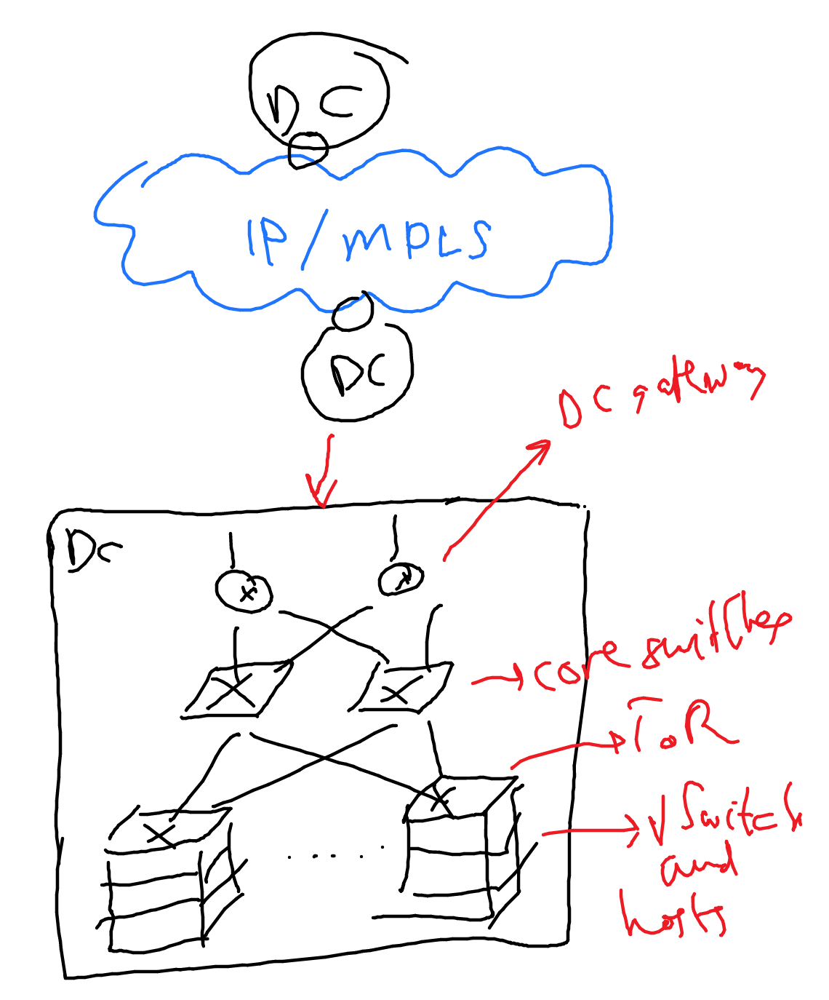
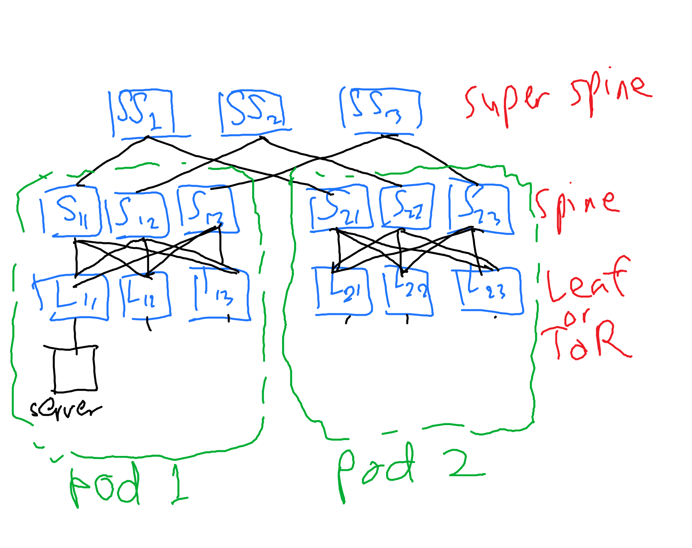
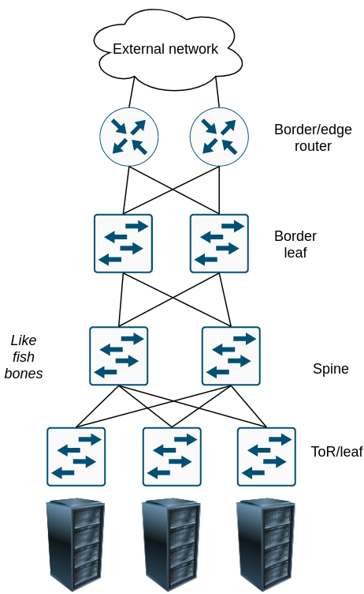
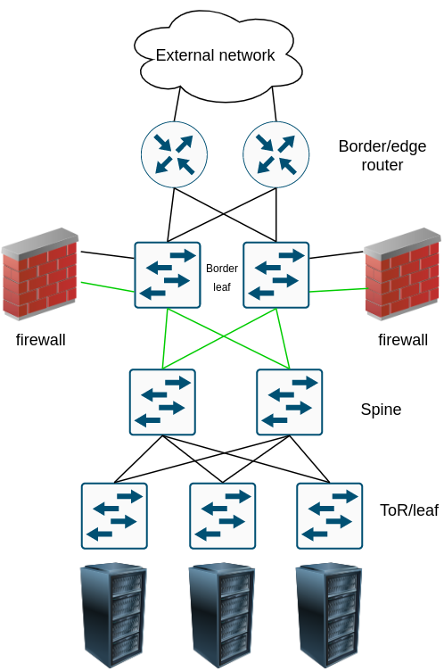

# Intro to data center (DC) networking

Credits:

- [Technologies and protocols for data center and cloud networking](https://ieeexplore.ieee.org/document/6588646)
- [layer 3 switching vs router](https://community.fs.com/blog/layer-3-switch-vs-router-what-is-your-best-bet.html)
- [Cloud Native Data Center Networking](https://cumulusnetworks.com/lp/cloud-native-data-center-networking/)

- Backbone: MPLS
- vswitch: virtual switches, virtualized in the hosts inside the rack
- ToR: hardware, may support VLAN
- DC gateway: to outside. connected to PE router
  - virtual routing, IP-VPN/L2 VPN provider edge
  - may use VRRP for redundancy

It should be noted that the "switch" inside the data center does not only mean L2 switch, but it can also be a L3 switch (read [here](https://community.fs.com/blog/layer-3-switch-vs-router-what-is-your-best-bet.html)). Both can do the L3 routing such as OSPF, BGP, RIP, etc. The main difference between L3 swithces and routers:

- Routers usually run on processors, L3 switches run on ASIC (faster)
- Routers can do NAT, L3 switches cannot do it
- Routers can have WAN interfaces, L3 switches do not have it

L3 switch in a DC has processors and switching silicon (ASIC). The packet forwarding is not handled by processor, thus, the Network Operating System (NOS) does not handle the packet forwarding. The packet forwarding is handled by the switching silicon.

## Intra-DC

Topology: spine-leaf (or clos). The above image is only one example of scaling clos topology with super spines. See the [Cloud Native Data Center Networking](https://cumulusnetworks.com/lp/cloud-native-data-center-networking/) book for more info.

The best practice is to use BGP with MRAI set to 0 inside the data center with this AS numbering scheme:

- All leaves has different ASN
- Spines within the same pod have the same ASN, but different ASN for different pod
- Super spines have the same ASN

This way of AS numbering avoids BGP path hunting. What is BGP path hunting?

BGP path hunting is a tendency of BGP to hunt a path, making it longer and longer, before it converges. Typically this happens after a BGP prefix withdrawal. The main culprit is the 30 seconds MRAI. The AS numbering as the above rule alleviates the BGP path hunting because BGP will not forward advertisement that comes from its' own AS number. Another thing to do to avoid path hunting is to set the MRAI to 0 second. Read more about path hunting on [noction.com](https://www.noction.com/blog/bgp-path-hunting) and [Paul Jakma's blog](https://paul.jakma.org/2020/01/21/bgp-path-hunting/).

### Network Virtualization in a DC

Typically, network virtualization protocols in a DC are:

- VXLAN (most common)
- VLAN (not really popular because it only supports much smaller number of networks compared to VXLAN)
- VRF

### Multicast routing in a DC

Application level multicasting is generally avoided because the multicast routing is complex. It is commonly used only of EVPN/VXLAN.

## Connecting DC to an external network/internet

A few points:

- In a cloud native apps, east-west traffic is more crowded than the north-south. So, the bandwidth and the edge router are less powerful than the spines/leaf.

### How a clos topology is connected to the external network/internet

A group of leaves+servers makes a pod. A group of border leaves+border router makes a border pod.

### Routing protocol at the edge

The edge/border router is eBGP peered with the ISP(s) routers. The border leaves have to strip off the privatet ASNs of the internal DC.

### Services at the border pod

Usually firewalls and load balancers. Let's take a deeper look at firewalls as an example.

The border leaves use 2 VRF, green for the internal network and black for the external network. The firewalls have 2 BGP sessions: one for the black and one for the green. So, the traffic going in from the outside and vice versa must travel hrough the firewall.

### What aboutt hybrid cloud?

Hybrid cloud is a combination of having infrastructure in a real data center as well as in a cloud provider like AWS ([VPC](https://aws.amazon.com/vpc/)). What we usually want to do is to connect these 2 networks. There are 2 ways:

- **VPN**

VPN IPSec. This is simplest, not flexible, slowest, cheapest. Only do this if the data transferred are small. If it's like sending json here and there, probably this is enough. Maybe.

The routing protocol is setup on top of this IPSec. Maybe it uses GRE too so that they can peer with BGP or any other routing protocol (TODO: confirm this by digging some more info).

- **Direct connectivity**

AWS has Direct Connect, Azure has ExpressRoute, GCP has Cloud Interconnect.

It does this via *colocation* or *point-to-point ethernet* or *MPLS VPN*.

The data center and the cloud provider builds a VLAN with 802.1Q. Then, use BGP to peer.

## Inter-DC

https://sites.google.com/site/amitsciscozone/home/data-center/data-center-interconnect-part-1

BGP IP MPLS. MPLS over GRE? read https://sites.google.com/site/amitsciscozone/home/data-center/data-center-interconnect-part-1

https://www.networkcomputing.com/networking/network-automation-using-python-bgp-configuration

https://www.batfish.org/

Just a note:

- MPLS separates route in L2.5
- GRE in L3
- VRF just builds a virtual table inside a router
