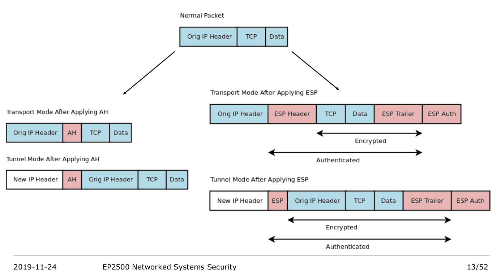

# IPsec

Sources:

- slide of KTH's EP2500 Networked Systems Security (2019)
- https://en.wikipedia.org/wiki/IPsec
- http://www.unixwiz.net/techtips/iguide-ipsec.html
- https://kb.juniper.net/InfoCenter/index?page=content&id=KB5302&actp=METADATA#
- https://openvpn.net/vpn-server-resources/site-to-site-routing-explained-in-detail/
- http://www.internet-computer-security.com/VPN-Guide/NAT-T.html
- https://security.stackexchange.com/questions/149219/why-doesnt-ipsec-esp-protect-the-ip-header
- https://community.cisco.com/t5/security-documents/how-does-nat-t-work-with-ipsec/ta-p/3119442#:~:text=Devices%20exchange%20two%20NAT%2DD,match%20a%20NAT%20device%20exists.&text=ESP%20packet%20will%20be%20encapsulated%20inside%20a%20UDP%2F4500%20packet.
- https://en.wikipedia.org/wiki/NAT_traversal

- Security at the network layer
- Internet Key Exchange (IKE) is the protocol for key establishment (Security Association (SA) setup)



Source: KTH EP2500 Networked System Security (2019)

## Tunnel mode vs transport mode

Transport mode provides a secure connection between 2 endpoint. For VPN, it's for client-to-site VPN. Transport does not add a new IP header.

Tunnel mode brings the whole packet into a tunnel (that's why there is new IP header prepended, and the src IP and dest IP can be different). This is typically used for site-to-site VPN.

Example of site-to-site:

```
office A
--------------------------------
host -> OpenVPN gateway client |
-------------------|------------
                   |
                   internet
                   |
-------------------|-----------------
        OpenVPN access server       |
                   |                |
                destination server  | office B
-------------------------------------
```

Host -> openVPN gateway client: normal IP packet
openVPN gateway client -> openVPN access server: IPsec tunnel mode
openVPN access server -> destination server: normal IP packet

## AH vs ESP

- Authentication Header (AH) -> for integrity and authentication protection
- Encapsulating Security Payload (ESP) -> encryption, integrity, authentication

### AH

- AH MACs the IP packet (header + payload), excluding IP TTL and the IP checksum fields. Therefore, AH protects the IP headers (unlike ESP, ESP does not protect IP header)
- Since AH calculate the hash of the whole IP packet, including the source IP, *AH does not work with NAT, since NAT will change the source IP which will break the integrity validation*.


Image source: http://www.unixwiz.net/techtips/iguide-ipsec.html


Image source: http://www.unixwiz.net/techtips/iguide-ipsec.html

### ESP

- ESP encrypts the TCP header + TCP payload, and hash (or MAC) the SPI, sequence number, TCP header, and TCP payload.
- ESP does not protect IP header, so NAT is possible (with a workaround: NAT traversal)
- Why vanilla NAT (especially PAT, beause it changes the source port) does not work: ESP encrypts the TCP header, while the source (and destination) port is in the TCP header. Workaround: NAT traversal.
  - Basic idea of NAT traversal: the ESP header in the SPI field is encapsulated into a UDP (src port: 4500, dst port: 4500; that port number is reserved for IPsec NAT traversal, see [wiki](https://en.wikipedia.org/wiki/NAT_traversal))


Image source: http://www.unixwiz.net/techtips/iguide-ipsec.html


Image source: http://www.unixwiz.net/techtips/iguide-ipsec.html
