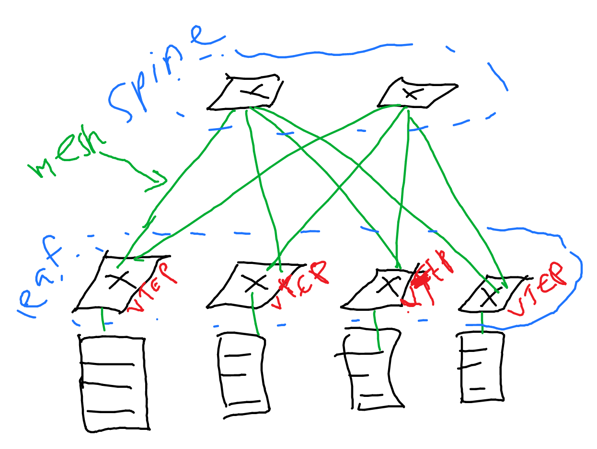

Sources: 

- https://www.youtube.com/watch?v=TIHvWb-gruc

## How a switch learn MAC addresses:

```
H1 ---eth0 S eth1--- H2
          eth 2 
           |
           |
           H3
```

When H1 wants to send data to H2, and it goes to eth0 of switch S, S knows that eth0 is connected to MAC H1. Then, it puts H1 MAC address and the interface eth0 to the MAC routing table. Because it does not know MAC address of H2, it floods the traffict to H3 and H2 (not to H1). When H2 replies, it saves the H2 mac address and the network interface the switch S connects to into the MAC routing table.

## Spanning Tree Protocol

Source: 

- https://www.youtube.com/watch?v=japdEY1UKe4
- https://en.wikipedia.org/wiki/Spanning_tree

Consider this loop scenario on layer 2:

```
     R2
    /  \
H--R1---R3
```

Host H sends ARP request with MAC broadcast address as its destination (or like the above section on "How a switch learn MAC addresses" which will flood the switch interface). R1 sends to R2 and R3. R2 sends to R3. R3 sends to R2 (the packet coming from R1). R3 sends to R1 (coming from R2). And so on and so on. Loop infinitely.

Spanning tree protocol creates a spanning tree to make a subgraph that contains no loop. Spanning tree is a subgraph that takes all vertices with minimal edges, hence creating a loop-free subgraph.

Basically what it does is blocking one of the interfaces of the switches to stop the loop. But the detail is more than that.

Watch here for more info and detail: https://www.youtube.com/watch?v=japdEY1UKe4 

Steps:

1. Elect a Root Bridge, and set the interfaces of the _Root Bridge_ into a "Forwarding" (FWD) state
2. Each non-root switch selects its _Root Port_: the best interface/port to the Root Bridge
3. Remaining links choose a _Designated Port_
4. All other ports are put in to a Blocking State

Roles of the ports:

1. Root ports: the best ports to reach thte Root Bridge
2. Designated Port: port with the best route to the Root Bridge on a link
3. Non-Designated Port: All other port that is in a blocking state

States of the port:

1. Disabled
2. Blocking
3. Listening: Only listen, not forwarding traffic and not learning MAC address
4. Learning: Not forwarding traffic but learning MAC address
5. Forwarding: sending and receiving traffic like normal

Listening and Learning states are transitional states.

STP encapsulates the message in Bridge Protocol Data Units (BPDU).

Re-visiting the steps:

1. How to elect the root bridge: every switche broadcasts BID. The one with the lowest BID is the Root Bridge.
2. How to select the Root Port: based on cost (like OSPF). The faster the link, the lowest the cost. Then, do some cost calculation.
3. How to select designated port:
4. How to select non-designated port:

## VLAN

Sources:

- https://www.youtube.com/watch?v=CXmGTowVbz0
- https://www.youtube.com/watch?v=fRuBHSf3Hac
- https://packetpushers.net/uses-of-mpls-in-the-enterprise-and-data-center/
- https://en.wikipedia.org/wiki/Virtual_LAN

VLAN is creating a virtual LAN within LAN. The goal is to make virtually isolated LAN networks within LAN.

Think about it like this: there are multiple virtual LAN of 192.168.1.0/24. VLAN tags on the Ethernet header isolates the traffic. VLAN ID (12 bits) is the unique ID used for each VLAN.

[IEEE 802.1q](https://en.wikipedia.org/wiki/IEEE_802.1Q) (read: dot1q) is the standard protocol for VLAN over Ethernet (802.3). With 802.1q, 4094 VLANs can be supported. This number is too small. That's why we have another one: VxLAN, that can support 16 million virtual LANs.

## VxLAN

Source: 

- https://www.youtube.com/playlist?list=PLDQaRcbiSnqFe6pyaSy-Hwj8XRFPgZ5h8
- [spine leaf architecture - fs](https://community.fs.com/blog/leaf-spine-with-fs-com-switches.html)
- https://en.wikipedia.org/wiki/Broadcast,_unknown-unicast_and_multicast_traffic#BUM_handling_in_VxLAN
- https://networkdirection.net/articles/routingandswitching/vxlanoverview/

Virtual eXtensible LAN (VxLAN) (RFC 7348) encapsulate layer 2 frame on top of UDP over IP. If VLAN uses VLAN ID, VxLAN uses VNI (VxLAN Network Identifier). VNI is 24 bits long. Since the encapsulation of VxLAN has many bits overhead, the use of jumbo frames is recommended.

Each VNI represents a L2 virtual network segment called a *bridge domain*.

The underlay network is the normal UDP-over-IP network. It can use normal L3 routing protocols such as OSPF or EIGRP. The overlay network is the L2 frame that the underlay network holds

VxLAN endpoint that terminates the VxLAN tunnels is called **VxLAN tunnel endpoints (VTEP)**. Open vSwitch supports VTEP. VTEP ingress encapsulate the traffic, and VTEP egress decapsulate the traffic.

```
host -> ingress VTEP -> (underlay IP network) -> egress VTEP -> host
```

VTEP has a table that maps the VNI to the IP address of egress VTEP, like in any other tunneling/VPN technologies. For example:

```
| VNI   | dest IP VTEP egress |
|-------|---------------------|
| VNI 1 | IP VTEP A           |
| VNI 2 | IP VTEP B           |
| VNI 3 | IP VTEP B           |
```

In the spine-leaf architecture (or Clos network topology) as the underlay network, the VTEPs are in the leaf switches.



Note that spine-leaf architecture makes the distance to other hosts consistent, allowing for ECMP to play its role.

Now, how VTEP knows where to forward the traffic and how it can discover another VTEP? There are 3 ways:

1. Address learning
2. Bridging
3. EVPN

### Address learning

Two ways of doing address learning:

- Data plane learning: 
  - learning when needed (when traffic comes). 
  - Flood-and-learn style.
  - Looks similar to how Ethernet switch works when forwarding traffic
- Control plane learning: 
  - learning beforehand, like learning the destination IP addresses to build the table in routing.

Before going deeper, note these types of traffic that need to take a deeper look:

- Unicast traffic
- Broadcast, Unknown unicast, Multicast (BUM) traffic. Example: ARP.

BUM traffic is handled with one of these [techniques](https://en.wikipedia.org/wiki/Broadcast,_unknown-unicast_and_multicast_traffic#BUM_handling_in_VxLAN) (you can also say this is for VTEP discovery):

- Ecanpsulating BUM traffic into VxLAN packets addressed to a _multicast group_
  - multicast group corresponds with VNI(s)
  - When VTEP is alive, it uses IGMP to join the multicast group
  - The infrastructure (switches) must support multicast
  - This is the most commonly used
- Head end replication
  - When BUM traffic arrives, VTEP creates several unicast packets and sends them to the VTEP that support the VNI
  - Only if BGP EVPN is used
  - Suitable for smaller network; <20 VTEPs

 

# Security issues with ARP

- https://moodle.epfl.ch/pluginfile.php/2710119/mod_resource/content/2/ip1.pdf
- https://en.wikipedia.org/wiki/ARP_spoofing

ARP spoofing: attacker aims to associate its MAC address to the IP of the target, like the gateway, so that the traffic will flow through the attacker.

Mitigation:

- DHCP snooping: switch/wifi base station observes all DHCP traffic and remembers the mapping IP addr-MAC
- dynamic ARP inspection: switch filters all ARP and allows only valid answers
