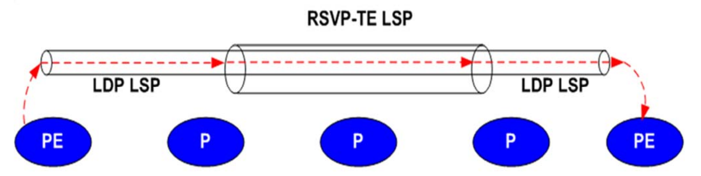

# MPLS

Sources:

- https://en.wikipedia.org/wiki/Multiprotocol_Label_Switching
- https://www.youtube.com/watch?v=MEWIdO40U54
- https://www.youtube.com/watch?v=U1w-b9GIt0k
- http://www.gompls.net/2009/08/understanding-mpls-header.html
- https://en.wikipedia.org/wiki/Ethernet_frame#Types
- https://en.wikipedia.org/wiki/EtherType
- http://docs.frrouting.org/en/latest/ldpd.html
- https://networklessons.com/mpls
- https://archive.nanog.org/sites/default/files/tuesday_tutorial_steenbergen_mpls_46.pdf
- https://networkengineering.stackexchange.com/questions/47425/why-does-mpls-need-an-igp-like-ospf-in-order-to-work
- https://en.wikipedia.org/wiki/Label_Distribution_Protocol

Multiprotocol label switching (MPLS) is a routing technique that is based on short path labels, not the network addresses. It does not involve complex lookups in a routing table.

Why MPLS is used/advantages of MPLS:

- This can be used as the tunnel between two sites. We can also say that the path between these sites is isolated from the other path in the network.
- We can influence the packet to chooose a certain path (with traffic engineering), independent of IP routing protocol's best path

MPLS operates at the layer between L2 and L3, and often referred to as the L2.5. This is also known as shim header.

How routers know that this packet is MPLS or not? Routers look at the Ethertype field in the Ethernet header. The Ethertypefield defines what protocol it brings. For MPLS, the value for Ethertype field is 0x8847 (and for IPv4 it's 0x0800, and 0x0806 for ARP, etc. See [wiki](https://en.wikipedia.org/wiki/EtherType)). (Not related, just for info: in the IP header, there is a field in the IP header that serves the same purpose: protocol header. That's why introducing a new protocol on top of other protocol might get cumbersome because this the routers might need to recognize this field)

## MPLS operation

```
                            (MPLS domain)
(office, city A) --- ([LER] --- [LSR] --- [LER]) --- (office, city B)
   1.1.1.0/24                                          2.2.2.0/24
```

- Label Edge Router (LER) or Provider Edge (PE): Located at the edge of an MPLS network. Assigned label to the packet for the first time (ingress LER) and remove it (egress LER). Customer networks are connected to LERs.
- Label Switch Router (LSR) or Provider (P): located in the middle of an MPLS network. LSR sees the label on the packet and use it to forward the packet.

Take a look at this example:

A packet from the office in city A wants go to to the office in city B (src: 1.1.1.6, dst: 2.2.2.6). The LER will inspect this packet and match the dest IP to the label in the table of Forwarding Equivalence Classes (FEC). Example of the FEC table:

```
| IP addr    | label |
|------------|-------|
| 2.2.2.0/24 | 17    |
| 6.6.6.0/24 | 18    |
```

The label 17 is pushed to the shim header (MPLS PUSH operation).

The LSR, when receiving the packet, will lookup to the Label Information Base (LIB) table and swaps the label for a label (MPLS SWAP operation). Example of the LIB table:

```
| Old label | New label |
|-----------|-----------|
| 17        | 69        |
| 18        | 70        |
```

When the egress LER table receives the packet, it pops the label (MPLS POP operation) and forward it to the office in city B using a normal IP packet.

The path that the MPLS packet goes through is called the **Label Switched Path (LSP)**. This path is established by Label Distribution Protocol (LDP, a manual and simple version) or RSVP-TE (traffic engineering, a more sophisticated approach). LSP is unidirectional (one way). That means the paths for the packet in and out may be different.

### MPLS LDP

Sources: 

- https://networklessons.com/mpls/mpls-ldp-label-distribution-protocol
- https://networkengineering.stackexchange.com/questions/38588/rib-vs-fib-differences
- http://resources.intenseschool.com/mpls-ldp-lib-and-lfib/

LDP is a protocol for generating and exchanging MPLS labels. LDP is used to build and maintain LSP database, LDP relies on IGP to distribute the labels to neighboring MPLS routers.

As an analogy, MPLS LDP builds the forwarding table like other routing protocols (OSPF, BGP, RIP, etc) do. 

Routing protocols, like OSPF, BGP, and so on, is used to exchange prefix and other metrics. These are then calculated for the best path and then the routing table is saved into Routing Information Base (RIB). Use `show ip route` to see RIB. RIB is part of the *control plane*. The information from RIB is used to build the Forwarding Information Base (FIB), which is the table that says "the traffic egress towards IP address X should go through interface ethX". Router forwards packet using FIB. FIB is part of the *forwarding plane*.

MPLS LDP generates and exhanges MPLS labels. The MPLS enabled nodes must be peered. We may need to use IGP so that the MPLS nodes can connect to each other (like iBGP that relies on IGP). The label routing information is collected and saved into Label Information Base (LIB). LIB is part of the *control plane*. LIB is used to build the Label Forwarding Information Base (LFIB). LFIB is part of the *forwarding plane*. MPLS forwards packets using LFIB.


Image source: https://networklessons.com/mpls/mpls-ldp-label-distribution-protocol

### RSVP-TE

Traffic Engineering (TE): the ability to control where and how traffic is routed, independent of best path calculation of routing protocol.
Reason: prevent congestion, manage capacity, prioritize different services

Two mpls routing protocols: LDP, RVSP-TE

A network can use both: LDP for MPLS VPN, RSVP-TE for traffic engineering feature



Image source: https://archive.nanog.org/sites/default/files/tuesday_tutorial_steenbergen_mpls_46.pdf


# MPLS VPN

Sources:

- https://en.wikipedia.org/wiki/MPLS_VPN
- https://en.wikipedia.org/wiki/Layer_2_MPLS_VPN
- https://en.wikipedia.org/wiki/Virtual_routing_and_forwarding
- https://www.rogerperkin.co.uk/ccie/mpls/cisco-mpls-tutorial/
- https://networklessons.com/mpls/mpls-layer-3-vpn-explained
- https://en.wikipedia.org/wiki/Multiprotocol_BGP
- https://ccieblog.co.uk/mpls/difference-between-the-rd-and-rt

MPLS VPN is VPN that uses MPLS to operate (not IPSec). 3 types of MPLS VPN: Point to point (pseudowire), L2 MPLS VPN (VPLS), L3 MPLS VPN (VPRN)

1. Pseudowire (point-to-point)

Used by SCADA master controller related stuffs.

2. L2 MPLS VPN (VPLS)

Typically used to route traffic between > 2 data center locations. It's like building L2 VLANs between sites. ISP sells this service.

3. L3 MPLS VPN (VPRN)

L3 MPLS VPN  uses Virtual Routing & Forwarding (VRF) to segment routing tables for each customer utilizing the service. The VRF is only on the PE router, not on the P. With VRF, the router has multiple instance of routing tables. It's the L3 equivalent to the L2 VLAN (see previous explanation about L2 MPLS VPN).

Since two customers of the L3 MPLS VPN may have the same IP address spaces the PE router may get confused when routing the packet. Example:


Image source: https://networklessons.com/mpls/mpls-layer-3-vpn-explained

To make it unique, we prepend a **Route Distinguisher (RD)** to the IP prefix of each customer. RD is 64 bit long, with a format of ASN:NN. ASN is the ISP ASN and NN is the unique number for each customer. The RD just makes sure that the route is unique in the VPNv4 BGP table.

```
  [RD]  | IPv4 prefix
 64 bit     32 bit
```

The combination of RD and the IP prefix is called VPNv4 route. The VPNv4 route will be advertised by **Multiprotocol BGP (MP-BGP)**. MP-BGP is an extension of BGP that allows different types of address to be distributed. The UPDATE of MP-BGP has a new Network Layer Reachability Information (NLRI) format that has these attributes: RD, IPv4 prefix, next hop, VPN label.

The RD is just to make sure the route is unique on the table. **Route Target (RT)** is like a tag defines which prefixes get imported and exported on the PE routers. RT is put on the BGP *extended community attribute*.

When a packet from a customer enters the PE router, the ingress PE imports the RT. The egress PE router exports the RT to associate the tag with the customer VRF. Example:

```
vrf definition cust_x
 rd 1:1
 route-target import 100:100
 route-target export 100:100

int fa0/0
 description connection to Customer A Birmingham Site
 ip vrf forwarding cust_x
```

Read more about RD and RT here: https://ccieblog.co.uk/mpls/difference-between-the-rd-and-rt

# Appendix

## VRF Lite

Virtual Routing and Forwarding (VRF) is a virtual routing tables. It allows one device to have multiple routing tables. In other words, a VRF is a virtual routing table. It separates the traffic on a router at L3.


Image source: [networkdirection.net](https://networkdirection.net/articles/routingandswitching/vrflite/)

Routes in a VRF can overlap with routes in another VRF.

VLAN separates L2 traffic, it's like having a virtual switch for each VLAN. If there is a router connecting one VLAN to another, one VLAN can communicate with another VLAN. This is unwanted because we want a full separation of traffic. Also, in a multitenancy case, the IP address can overlap. VRF helps with these problems because it uses separate routing table.

Networks in a single VRF can communicate with each other. Network in another VRF cannot communicate with each other. So, if VLAN 1 and VLAN 3 reside in a single VRF, they can communicate to each other.

Now what is this VRF Lite? Why it is "lite"? The VRF is used for MPLS VPN. VRF lite is the VRF that is not used for MPLS VPN.
