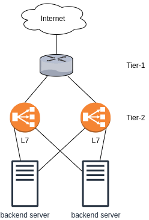
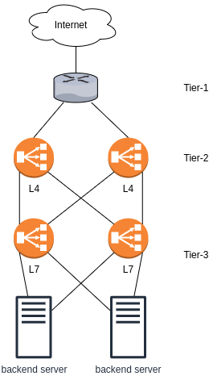
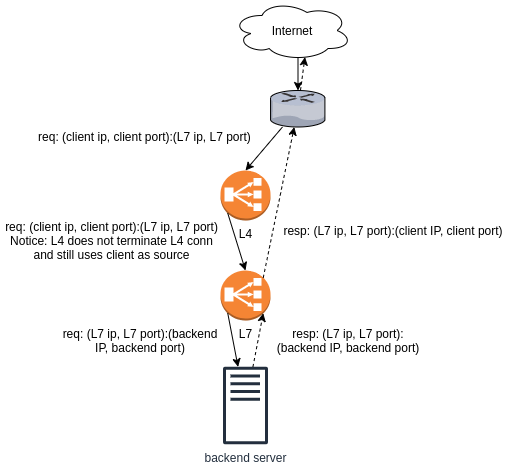

# Multi-tier load-balancers

Sources:

- https://vincent.bernat.ch/en/blog/2018-multi-tier-loadbalancer

To see the reasoning and flow of the logic, see [vincent bernat's article](https://vincent.bernat.ch/en/blog/2018-multi-tier-loadbalancer).

## Option 1: 2 layers

### Tier-1

- BGP router(s) with ECMP that is able to do resilient hashing
  - BGP router uses hash (like a hashtable) to do the connection tracking and ECMP load balancing. If we add/remove the endpoint, it can purge all existing connections to recompute the hash. Resilient hashing uses consistent hash to minimize the number of connection reset during the hash recomputation. See [[metallb's docs](https://metallb.universe.tf/concepts/bgp/)]
  - [Juniper](https://www.juniper.net/documentation/en_US/junos/topics/topic-map/switches-interface-resilient-hashing.html#id-understanding-the-use-of-resilient-hashing-to-minimize-flow-remapping-in-trunkecmp-groups) and [Cumulus](https://docs.cumulusnetworks.com/cumulus-linux/Layer-3/Equal-Cost-Multipath-Load-Sharing-Hardware-ECMP/) provide resilient ECMP
- This is usually provided by the cloud provider

### Tier-2

- Application layer load balancer
  - It can do HTTP path based routing, TLS termination, health-check the backends, rate-limiting, etc
- We can use Nginx, HAProxy, Envoy, etc.

## Option 2: 3 layers

This architecture aims to mitigate the problems that arise if the BGP router in the tier-1 does not have the resilient hash for ECMP. We add L4 LB between BGP routers and L7 LB to give a resilient hash feature. We also use Direct Server Return (DSR) to return response directly from the L7 LB to the BGP router without going through the L4 LB. In short, we add a layer of stateless L4 LB with consistent hashing. 

### Tier-1: BGP router

- BGP router with ECMP, with or without resilient hash

### Tier-2

- L4 load balancers
- Why is it called L4 LB? What does it do with the transport layer?
  - It uses a tuple `(src ip, src port, dst ip, dst port)` for the hash input (remember, port is on L4)
  - See [ip-sysctl](https://www.kernel.org/doc/Documentation/networking/ip-sysctl.txt) config to setup (`fib_multipath_hash_policy=1`)
- The transport layer load balancing in the kernel is implemented by [IPVS](http://www.linuxvirtualserver.org/software/ipvs.html). Use kernel > 4.18 to use [Maglev](https://static.googleusercontent.com/media/research.google.com/en//pubs/archive/44824.pdf) scheduler (Maglev uses consistent hashing)
- The frontend for IPVS is [Keepalived](https://www.keepalived.org/)
  - It does some health check with BFD
  - It does a failover with VRRP ([techtarget](https://searchnetworking.techtarget.com/definition/VRRP), [geeksforgeeks](https://www.geeksforgeeks.org/introduction-of-virtual-router-redundancy-protocol-vrrp-and-its-configuration/))
- We use Direct Server Return (DSR) to improve performance
  - The flow is like this: 
    - internet->bgp router->l4 lb->l7 lb->backend->l7 lb->bgp router->internet
  - See that l7 lb skip the l4 lb
  - This is also useful when the response is much larger than the request (use case: streaming platform like youtube)
  - Read more in [medium](https://medium.com/@dieswaytoofast/direct-server-return-a-quick-primer-6967968bcb30)

### Tier-3

- The L7 LB, same as that in tier-2 of option 1

### Misc notes

Some of the useful things to use (TODO: demo on GNS3):

- FRRouting
- ExaBGP
- Keepalived

modern load balancing: https://blog.envoyproxy.io/introduction-to-modern-network-load-balancing-and-proxying-a57f6ff80236

proxy protocol: https://inkel.github.io/posts/proxy-protocol/

what is direct server return: 
- https://medium.com/@dieswaytoofast/direct-server-return-in-the-real-world-b08affb1fe74
- https://medium.com/@dieswaytoofast/direct-server-return-a-quick-primer-6967968bcb30
- https://www.haproxy.com/blog/layer-4-load-balancing-direct-server-return-mode/#:~:text=Direct%20server%20return%20is%20usually,passing%20through%20the%20load%2Dbalancer.

path mtu discovery: 
- https://en.wikipedia.org/wiki/Path_MTU_Discovery
- https://blog.cloudflare.com/path-mtu-discovery-in-practice/
