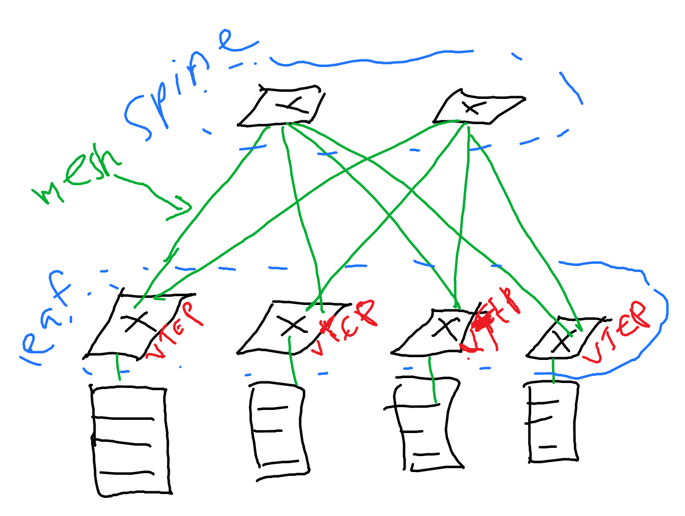

# Network Virtualization

Network virtualization models are:

- Inline or overlay based virtualization
  - Inline means the intermediary nodes are aware of the virtualized traffic. Example: VRF and VLAN
  - Overlay means the intermediary nodes are not aware of the virtualized traffic. Example: VXLAN, MPLS
- Service abstracion
  - L2 or L3

## VLAN

Sources:

- https://www.youtube.com/watch?v=CXmGTowVbz0
- https://www.youtube.com/watch?v=fRuBHSf3Hac
- https://packetpushers.net/uses-of-mpls-in-the-enterprise-and-data-center/
- https://en.wikipedia.org/wiki/Virtual_LAN

VLAN is creating a virtual LAN within LAN. The goal is to make virtually isolated LAN networks within LAN.

Think about it like this: there are multiple virtual LAN of 192.168.1.0/24. VLAN tags on the Ethernet header isolates the traffic. VLAN ID (12 bits) is the unique ID used for each VLAN.

[IEEE 802.1q](https://en.wikipedia.org/wiki/IEEE_802.1Q) (read: dot1q) is the standard protocol for VLAN over Ethernet (802.3). With 802.1q, 4094 VLANs can be supported. This number is too small. That's why we have another one: VxLAN, that can support 16 million virtual LANs.

## VxLAN

Source: 

- https://www.youtube.com/playlist?list=PLDQaRcbiSnqFe6pyaSy-Hwj8XRFPgZ5h8
- [spine leaf architecture - fs](https://community.fs.com/blog/leaf-spine-with-fs-com-switches.html)
- https://en.wikipedia.org/wiki/Broadcast,_unknown-unicast_and_multicast_traffic#BUM_handling_in_VxLAN
- https://networkdirection.net/articles/routingandswitching/vxlanoverview/

Virtual eXtensible LAN (VxLAN) (RFC 7348) encapsulate layer 2 frame on top of UDP over IP. If VLAN uses VLAN ID, VxLAN uses VNI (VxLAN Network Identifier). VNI is 24 bits long. Since the encapsulation of VxLAN has many bits overhead, the use of jumbo frames is recommended.

Each VNI represents a L2 virtual network segment called a *bridge domain*.

The underlay network is the normal UDP-over-IP network. It can use normal L3 routing protocols such as OSPF or EIGRP. The overlay network is the L2 frame that the underlay network holds.

Why the underlay network is UDP? Because the routers can use the source port and dest port to allow for consistent load balancing even if the real packet is encapsulated with a new source and destination IP address.

VxLAN endpoint that terminates the VxLAN tunnels is called **VxLAN tunnel endpoints (VTEP)**. Open vSwitch supports VTEP. VTEP ingress encapsulate the traffic, and VTEP egress decapsulate the traffic.

```
host -> ingress VTEP -> (underlay IP network) -> egress VTEP -> host
```

VTEP has a table that maps the VNI to the IP address of egress VTEP, like in any other tunneling/VPN technologies. For example:

```
| VNI   | dest IP VTEP egress |
|-------|---------------------|
| VNI 1 | IP VTEP A           |
| VNI 2 | IP VTEP B           |
| VNI 3 | IP VTEP B           |
```

In the spine-leaf architecture (or Clos network topology) as the underlay network, the VTEPs are in the leaf switches.



Note that spine-leaf architecture makes the distance to other hosts consistent, allowing for ECMP to play its role.

Now, how VTEP knows where to forward the traffic and how it can discover another VTEP? The process is called address learning, and there are 2 ways:

1. Data plane learning: Bridging
2. Control plane learning: EVPN

### Address learning

Two ways of doing address learning:

- Data plane learning (bridging):
  - learning when needed (when traffic comes).
  - Flood-and-learn style.
  - Looks similar to how Ethernet switch works when forwarding traffic
- Control plane learning (EVPN):
  - learning beforehand, like learning the destination IP addresses to build the table in routing.
  - It uses MP-BGP to share MAC addresses and VTEP information
  - *This one is preferred*

Prerequisite:

- [Understanding VRF Lite](https://networkdirection.net/articles/routingandswitching/vrflite/)
- [Understanding MP-BGP](https://networkdirection.net/articles/routingandswitching/mp-bgp/)
- [Understanding leaking route with MP-BGP](https://networkdirection.net/articles/routingandswitching/mp-bgp/leakingrouteswithmp-bgp/)

Before going deeper, note these types of traffic that need to take a deeper look:

- Unicast traffic: usual, one to one traffic
- Broadcast, Unknown unicast, Multicast (BUM) traffic. Example: ARP.

BUM traffic is handled with one of these [techniques](https://en.wikipedia.org/wiki/Broadcast,_unknown-unicast_and_multicast_traffic#BUM_handling_in_VxLAN) (you can also say this is for VTEP discovery):

- Ecanpsulating BUM traffic into VxLAN packets addressed to a _multicast group_
  - multicast group corresponds with VNI(s)
  - When VTEP is alive, it uses IGMP to join the multicast group
  - The infrastructure (switches) must support multicast
  - This is the most commonly used
- Head end replication
  - When BUM traffic arrives, VTEP creates several unicast packets and sends them to the VTEP that support the VNI
  - Only if BGP EVPN is used
  - Suitable for smaller network; <20 VTEPs

#### Data plane learning: bridging

Data plane learning, known as bridging, is simpler, yet it does not scale well because of flooding method. With bridging, BUM traffic must be handled by multicast, and head end replication is not possible.

The process:

- Host A wants to send a packet to host B in the same VNI
- Host A sends an ARP request, which is a broadcast traffic (B in BUM)
- The ingress VTEP will multicast this ARP request to all VTEPs which have the same VNI
- Host B, after receiving the ARP req, will respond with ARP response. VTEPs will cache it too. ARP response is a unicast traffic.

#### Control plane learning: EVPN

This technique is like what routing protocols do: learn the route beforehand.

- Leaf switches are VTEPs
- All switches in the VXLAN topology runs BGP (leaf and spine switches)
- The switches peer with each other. Since it uses MP-BGP, the MAC address and the VTEP information is carried in the UPDATE message of the BGP

This has a big advantage: ARP suppresion. The flooding of ARP is minimized because the ARP request from host only reaches ingress VTEP. Ingress VTEP already learns the MAC address and the IP address associated with it through the MP-BGP. The ingress VTEP returns the ARP response.

## VRF Lite

Source: https://networkdirection.net/articles/routingandswitching/vrflite/

Virtual Routing and Forwarding (VRF) is a virtual routing tables. It allows one device to have multiple routing tables. In other words, a VRF is a virtual routing table. It separates the traffic on a router at L3.


Image source: [networkdirection.net](https://networkdirection.net/articles/routingandswitching/vrflite/)

Routes in a VRF can overlap with routes in another VRF.

VLAN separates L2 traffic, it's like having a virtual switch for each VLAN. If there is a router connecting one VLAN to another, one VLAN can communicate with another VLAN. This is unwanted because we want a full separation of traffic. Also, in a multitenancy case, the ## VRF Lite

Source: https://networkdirection.net/articles/routingandswitching/vrflite/

Virtual Routing and Forwarding (VRF) is a virtual routing tables. It allows one device to have multiple routing tables. In other words, a VRF is a virtual routing table. It separates the traffic on a router at L3.


Image source: [networkdirection.net](https://networkdirection.net/articles/routingandswitching/vrflite/)

Routes in a VRF can overlap with routes in another VRF.

VLAN separates L2 traffic, it's like having a virtual switch for each VLAN. If there is a router connecting one VLAN to another, one VLAN can communicate with another VLAN. This is unwanted because we want a full separation of traffic. Also, in a multitenancy case, the IP address can overlap. VRF helps with these problems because it uses separate routing table.

Networks in a single VRF can communicate with each other. Network in another VRF cannot communicate with each other. So, if VLAN 1 and VLAN 3 reside in a single VRF, they can communicate to each other.

Now what is this VRF Lite? Why it is "lite"? The VRF is used for MPLS VPN. VRF lite is the standalone VRF that is not used for MPLS VPN.
IP address can overlap. VRF helps with these problems because it uses separate routing table.

Networks in a single VRF can communicate with each other. Network in another VRF cannot communicate with each other. So, if VLAN 1 and VLAN 3 reside in a single VRF, they can communicate to each other.

Now what is this VRF Lite? Why it is "lite"? The VRF is used for MPLS VPN. VRF lite is the standalone VRF that is not used for MPLS VPN.
