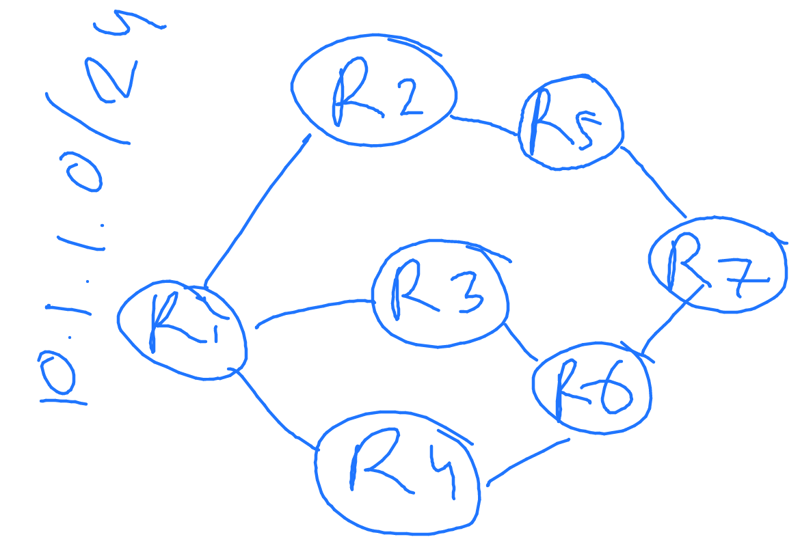

# Link state vs distance vector routing

Credits:

- [Cloud Native Data Center Networking](https://cumulusnetworks.com/lp/cloud-native-data-center-networking/)

- Link state: best path counts the links' capabilities
- Distance vector: best path based on number of hops
- In link state, a roter gossips about everybody in the network to its neighbors
- In distance vector, a router gossips about it's neighbors with everybody else

## Link state is more chatty than distance vector when there is a network change



Let's say the cost of the links are all the same. Then, in both link state and distance vector, R7 knows 2 ways to reach 10.1.1.0/24 via R5 and R6. Then, the link between R1 and R4 is down, and R4 will advertise this condition to all its' neighbors. Optimally, this should not affect how R7 sends to 10.1.1.0/24 because it still can go through R5 or R6.

In the link state, R6, after receiving the LSA from R4, will advertise the LSA to R7. R7 will recompute the shortest path and eventually realize it still can go through R6. What a waste.

In the distance vector, R6 will not bother telling it to R7 because it builds the table first, and if there is no need to forward the table, it will not send the advertisement.

## Link state converges faster

In the link state, the advertisement is flooded without modification by other routers. So, the other routers in the network will quickly know the network changes and states.

In the distance vector, a router cannot forward updates without calculating the distance first. In addition, there is a hold-down timer to avoid count-to-infinity problem. So, the delay is larger in the distance vector for the network to converge.

# OSPF

Sources:

- https://www.youtube.com/watch?v=kfvJ8QVJscc
- https://www.youtube.com/watch?v=QyymlFWDEgM
- https://www.networkworld.com/article/2348778/my-favorite-interview-question.html
- https://www.geeksforgeeks.org/route-poisoning-and-count-to-infinity-problem-in-routing/#:~:text=The%20main%20issue%20with%20Distance,updates%20at%20the%20same%20time.
- https://moodle.epfl.ch/pluginfile.php/2736146/mod_resource/content/0/lsSols.pdf

## Concept of link state protocols

1. Every router floods info about itself, its links, its neighbors to all routers. Each router calculates shortest path independently.
   1. This prevents loop since it maps the whole network. RIP, which does not know the routers behind its direct neighbor, is vulnerable to loop
2. Because it maps the whole network, to make it scalable, the network is divided into areas
3. The inter-area network is like a distance vector.

## Link state protocol: OSPF

1. OSPF is a link state routing protocol: it calculates the "link state" as the metric for shortest path selection. Link state is static (the bandwidth capacity of the link), not the dynamic, actual state of the link at a time. RIP, on the other hand, is a distance-vector routing which calculates the number of hops as the metric.
2. OSPF operates by exchanging Link State Advertisement (LSA)
3. The LSA is kept in a Link State Database (LSDB). The LSDB is the same in all routers.
4. All routers have a full picture of the topology. Therefore, it does not scale for a large network.

The main steps in OSPF:

1. Become neighbors
2. Exchange LSDB info
3. Calculate best path

**1. Become neighbors:**

- To become neighbors, routers send `hello` packets bringing the router ID. The router ID looks like an IPv4 address, but it's not IPv4 address. It can be configured manually or it will take the loopback address as the ID or the highest up IP address if no loopback is set.
  - `hello` message is used to discover neighboring routers and detect failures.
- Select a Designated Router (DR) and Backup DR (BDR). If there is an event from any router, by default, every router that receives the advertisement will broadcast the received advertisement. If there is a DR, only the DR will re-advertise it, preventing routers from flooding the network.
- When two routers become neighbhors, they *synchronize* their LSDB.

**2. Exhange LSDB info:**

- Router A and B exchange Database Description (DBD), containing what network it has on the LSDB. For example, Router B has info (link state/bandwith data) about network 192.168.1.0/24 that router A does not know. Then, the router A will send a Link State Request (LSR) to ask for the link info about that network.
- Router B will send the information in a Link State Update (LSU)
- Router A will send an ack in a Link State Acknowledgement (LSAck)

**LSDB and LSA**

- After synchoronized, routers send and receive LSA.
- LSA describes the states of the routers: their attached networks and neighboring routers
- LSAs are flooded inside IP packets (unlike BGP which uses TCP)
- LSA contains a sequence number (only new seq number is accepted to prevent loop) and age.

**3. Calculate best path:**

Caculating best paths is performed by routers independently, based on the same LSDB among all routers. OSPF uses Dijkstra algorithm to calculate the best path.

```
cost = reference bandwidth / interface bandwidth

default reference bandwith = 10^5 Kbps
```

For example, the FastEthernet bw is 10^5 Kbps and the Ethernet is 10^4 Kbps. The cost of FastEthernet is 1 and the Ethernet's is 10. FastEthernet is smaller, meaning it's a more economical path (faster). OSPF chooses a path with the smallest cost.

If the OSPF network is too large, it can cause problems:

1. Big LSDB, takes up space
2. Big routing table, slow
3. Too much LSA, flooding the network and makes re-calculation of best path too often

**How to manage large OSPF network: Multi-area OSPF.**

Split OSPF into areas. There must be an area 0.

```
------------------            ---------------------
|  area 1        |            |     area 0        |
| 10.10.0.0/24   |----ABR_1---|   12.12.0.0/24  ASBR-----another AS
| 10.10.1.0/24   |            |   12.12.1.0/24    |
------------------            --------------------|
                                        |
                                      ABR_2
                                        |
                              ---------------------
                              |     area 2        |
                              |     13.13.0.0/24  |
                              |     13.13.1.0/24  |
                              ---------------------
```

The Area Border Router (ABR) aggregates the network within the area and advertises it to another area. SPF calculation is only done in the ABR. ABR is a member of 2 or more areas.

Inside an area, it's a link state routing. Inter-area is a distance vector. It's analoguous to IGP-EGP. Since inter-area OSPF is like a distance vector, it is vulnerable to loop. To prevent loop, traffic from one area to another **must go through area 0**. This is called **split horizon**.

Autonomous System Border Router (ASBR) is the border router that is connected and make an eBGP peer session to another ASBR of different AS network.

# A little bit about distance vector routing (like RIP)

- RIP uses bellman-ford algorithm to compute the shortest path.
- Unlike OSPF, it does not map the whole network

## Routing loop and count-to-infinity problem in distance vector

Sources:

- https://en.wikipedia.org/wiki/Route_poisoning#:~:text=Route%20poisoning%20is%20a%20method,become%20invalid%20within%20computer%20networks.&text=In%20the%20case%20of%20RIP,a%20routing%20update%20is%20sent.
- https://www.geeksforgeeks.org/route-poisoning-and-count-to-infinity-problem-in-routing/
- https://en.wikipedia.org/wiki/Split_horizon_route_advertisement

```
R1 ----- R2 --x--R3
```

Before R2-R3 is broken, R2 knows it can go to R3 with a cost of 1 and R1 to R3 with a cost of 2. Then, R2-R3 is down. Before R2 advertises this, R2 receives an advertisement from R1 saying that R1 knows how to get to R3 with a cost of 2. Since R2-R1's cost is 1, R2 will think that it can go to R3 with a cost of 3 via R1. Then, R2 advertises R2-R3 cost is 3 to R1. And it continues to infinity.

### Mitigation

1. Route poisoning: telling all nodes *immediately* when a link is down that the link is down. How to tell? In RIP, the max hop count is 15, so just tell that the failed link hop count to 16, which will invalidate the route.
2. **Split horizon**: prevents loop by prohibiting a router from advertising a route back onto the interface from which the route was learned. So on the example above, R1 does not advertise the route to R1-R3 to R2 because R1 learned the R1-R3 route from R2.

RIP combines route poisonong, split horizon, and holddown timer. Holddown timer starts when the link is down. When the timer is still running, all advertisement about the link to the router is ignored, unless if it comes from the router that used to be down.
