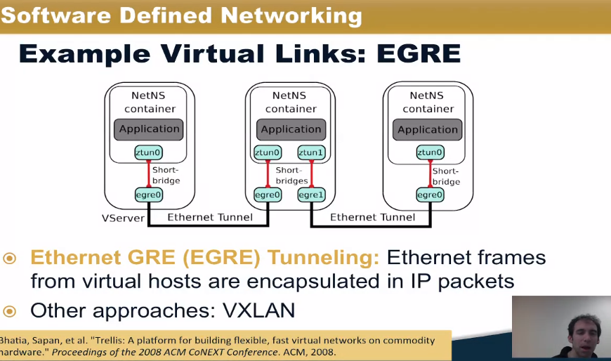
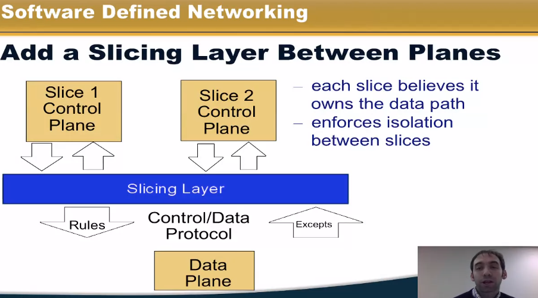

# Virtualization

Source: coursera SDN

## Network virtualization

### What

Network virtualization: abstraction of the physical network. Logical networks running on a common shared physical substrate. Aspects that can be virtualized:

- Nodes (as a virtual machines)
- Links (with tunnels such as Ethernet GRE)
- Storage

Analogy with server virtualization:

Image source: https://www.youtube.com/watch?v=G1lCF5VALsc

### How it is implemented

We need:

- Hypervisor for nodes (like KVM or Xen)
- Ethernet GRE or VxLAN for virtual links

### Relationship between SDN and virtual networks

- SDN separates data plane and control plane
- Virtual networks separate logical and phy networks
- SDN can be a useful tool for implementing virtual networks

Before going further: take a look at [multilayer switch vs router](https://community.fs.com/blog/layer-3-switch-vs-router-what-is-your-best-bet.html)

Multilayer switch can perform L3 routing. One of the difference is it does not have WAN port, so it's for intranet routing. It's also very fast since it uses SoC. It also has a lot more interfaces than routers.

## Network slicing

What is it? 

Network slicing:

- Divide the prod network into logical *slices*. Each slice controls its own packet forwarding
- Enforce strong isolation between slices

Ways to slice the network:

- By switch port (like VLANs)
- By application (TCP port)

## Network Function Virtualization

What is it?

- Network functions: the physical network nodes.
- NFV: The network functions are virtualized.

NFV is the new approach for deploying middlebox funcions on virtual appliances in the network.
