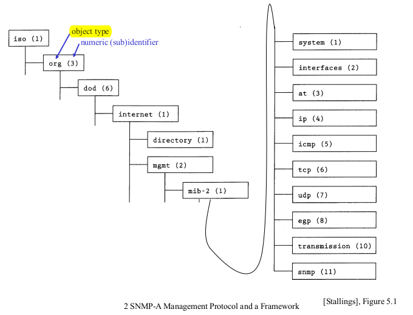

# SNMP

Simple Network Management Protocol (SNMP) is a protocol + framework for managing network.

```
    ----------------------
    | Management program |
    |      Manager       |      -> in management station computer 
    ----------------------
          /       \    
         /         \
        /           \ 
      Agent        Agent        -> in router, switches, printers, etc
```

- Manager is the program that connects and queries from agents
- Agents run on the network devices in the managed network, such as router, switches, printers, etc

- Management Information Base (**MIB**) is a collection of objects that are grouped and modeled for a management purpose
  - The examples objects are:
    - in routers: incoming traffic, outgoing traffic, etc
    - in printer: cartridge status, etc
- Object Identifier (**OID**) uniquely identifies objects in MIB



Example of OID for identifying TCP connection table: `1.3.6.1.2.1.6.13` (the last 13 is the object identifier for TCP conn table in the TCP node)

SNMP operations:

- get OID: OID must be leaf (look at the image above)
- get-next Y: get leaf object following OID Y
- set X a: set instance of object X to a
- trap: sent event to management station
