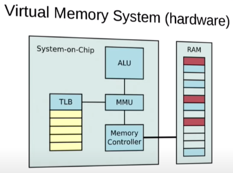

https://elinux.org/images/b/b0/Introduction_to_Memory_Management_in_Linux.pdf

https://www.youtube.com/watch?v=7aONIVSXiJ8

virtual memory: **mapping** virtual address to physical RAM; provides isolation, single address space

two address spaces:
1. physical addresses: used by hardware. example: DMA
2. virtual addresses: used by software. example: load/store instructions

mapping is done by hardware: MMU
- it sits between CPU and memory (part of CPU hardware, integrated).
- what it does:
  - maps accesses using virtual addresses to system RAM
  - maps accesses using virtual addresses to memory-mapped peripheral hardware
  - handle permission
  - generates page fault on an invalid address
- how MMU works:

Source: https://en.wikipedia.org/wiki/Memory_management_unit

Mapping/translation process:

source: https://en.wikipedia.org/wiki/Page_table

Source: https://www.youtube.com/watch?v=7aONIVSXiJ8

- MMU works with memory in a *unit* called **page**, which is usually 4Kb. The real frame that MMU is working on is called **page frame**.
- how shared memory works:
  - simply map the same **physical** frame into 2 different processes. The virtual addresses need not be the same. Syscall to request a specific virtual address to map the shared memory region: `mmap()`.
- Linux uses lazy (on-demand) allocation of physical pages. it defers the allocation. for the memory that gets allocated but does not get used, allocation never has to happen. it's a performance optimization. https://landley.net/writing/memory-faq.txt#:~:text=The%20Linux%20kernel%20uses%20lazy,with%20no%20physical%20pages%20attached.

how to make swap:

1. swap partition: a disk parition that is only for swap. 
2. swap file: make an empty file with `dd`, then make that file to a swap using `mkswap`

swap size: 

1. PC: twice the RAM size
2. server: half of RAM size

tweak swap:

swappiness
https://askubuntu.com/questions/157793/why-is-swap-being-used-even-though-i-have-plenty-of-free-ram

https://help.ubuntu.com/community/SwapFaq/#What_is_swappiness_and_how_do_I_change_it.3F

> What is swappiness and how do I change it?
The swappiness parameter controls the tendency of the kernel to move processes out of physical memory and onto the swap disk. Because disks are much slower than RAM, this can lead to slower response times for system and applications if processes are too aggressively moved out of memory.
>
> swappiness can have a value of between 0 and 100
>
> swappiness=0 tells the kernel to avoid swapping processes out of physical memory for as long as possible. For Kernel version 3.5 and newer it disables swapiness.
>
> swappiness=100 tells the kernel to aggressively swap processes out of physical memory and move them to swap cache