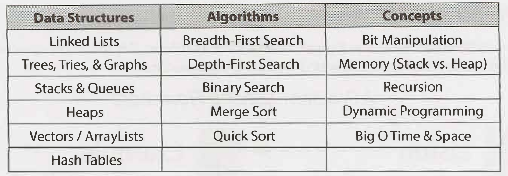

Main book: Cracking the coding interview by Gayle Laakmann McDowell

# Algorithms and Data Structure

# System design

https://github.com/donnemartin/system-design-primer#study-guide

follow the study guide for "short timeline"
